# 🎮 Player Behavior Analytics & Churn Prediction

### Data Engineering Pipeline for Multiplayer Game Server Logs

<p align="center">

**Transforming raw Minecraft server activity into actionable player behavior insights**

</p>

<p align="center">


</p>

---

## 📌 Overview

**Player Behavior Analytics & Churn Prediction** is an end-to-end **Data Engineering and Analytics project** designed to transform raw multiplayer game-server activity into structured player intelligence.

The project uses a Minecraft multiplayer server as the data source. Player activities are captured using **CoreProtect**, stored in a **SQLite database**, extracted and processed using **Python and pandas**, transformed into player-level behavioral metrics, and finally visualized through **Microsoft Power BI** dashboards.

The pipeline demonstrates a complete **Extract → Transform → Load (ETL)** workflow combined with behavioral analytics and basic churn-risk prediction.

---

## 🎯 Project Objectives

The project was developed to:

* Collect raw gameplay activity from a multiplayer Minecraft server
* Capture player activities using CoreProtect
* Store raw activity data in SQLite
* Extract structured datasets using Python
* Clean and preprocess raw gameplay records
* Transform events into meaningful player-level metrics
* Calculate player engagement scores
* Classify players according to their engagement level
* Identify potential rage-quit behavior
* Categorize players according to churn risk
* Build interactive Power BI dashboards
* Demonstrate real-world Data Engineering concepts through a gaming use case

---

# 🏗️ System Architecture

```mermaid
flowchart LR

    A["Minecraft<br/>Multiplayer Server"]
    B["CoreProtect<br/>Activity Logging"]
    C["SQLite<br/>Raw Database"]
    D["Python<br/>Data Ingestion"]
    E["Data Cleaning<br/>pandas"]
    F["Data Transformation<br/>Player Metrics"]
    G["Behavior Analytics<br/>Classification"]
    H["Churn Prediction<br/>Risk Categorization"]
    I["Final Analytics<br/>Dataset"]
    J["Microsoft<br/>Power BI"]

    A --> B
    B --> C
    C --> D
    D --> E
    E --> F
    F --> G
    G --> H
    H --> I
    I --> J
```



### Pipeline Flow

```text
Minecraft Server
       │
       ▼
 CoreProtect Plugin
       │
       ▼
 SQLite Database
       │
       ▼
 Data Ingestion
       │
       ▼
 Data Cleaning
       │
       ▼
 Data Transformation
       │
       ▼
 Player Behavior Analytics
       │
       ▼
 Churn Risk Prediction
       │
       ▼
 Final Analytics Dataset
       │
       ▼
 Power BI Dashboards
```

---

# ⚙️ Technology Stack

| Technology             | Purpose                          |
| ---------------------- | -------------------------------- |
| **PaperMC**            | Multiplayer Minecraft server     |
| **CoreProtect**        | Player activity logging          |
| **SQLite**             | Raw gameplay data storage        |
| **Python 3**           | Data engineering and analytics   |
| **sqlite3**            | SQLite database connectivity     |
| **pandas**             | Data cleaning and transformation |
| **CSV**                | Intermediate data storage        |
| **Microsoft Power BI** | Interactive visualization        |

---

# 📂 Project Structure

```text
player-behavior-analytics/
│
├── docs/
│   └── Final Report.pdf
│
├── scripts/
│   ├── ingest.py
│   ├── clean.py
│   ├── transform.py
│   ├── analytics.py
│   ├── run_pipeline.py
│   └── generate_sample_data.py
│
├── data/
│   ├── raw/
│   ├── clean/
│   └── output/
│
├── requirements.txt
├── README.md
└── .gitignore
```

---

# 🔄 ETL Pipeline

## 1. Data Collection

Gameplay activity is generated by players interacting with the Minecraft server.

CoreProtect records activities including:

* Player sessions
* Chat messages
* Block breaking
* Block placement
* Gameplay interactions

---

## 2. Data Ingestion

The `ingest.py` script connects to the CoreProtect SQLite database and extracts the required tables.

### Input

```text
plugins/CoreProtect/database.db
```

### Extracted datasets

```text
sessions.csv
chat.csv
blocks.csv
```

The ingestion process uses:

```python
sqlite3
pandas
```

---

## 3. Data Cleaning

The `clean.py` script prepares the extracted datasets for analysis.

Cleaning operations include:

* Removing null records
* Removing duplicate records
* Removing irrelevant columns
* Filtering empty chat messages
* Standardizing the required dataset structure

### Output

```text
clean_sessions.csv
clean_chat.csv
clean_blocks.csv
```

---

# 📊 Player Metrics

The transformation stage converts raw gameplay events into meaningful player-level metrics.

## Session Count

Measures how many times a player joined the server.

```text
Session Count = Number of login events
```

---

## Chat Count

Measures the number of chat messages sent by each player.

```text
Chat Count = Number of chat events
```

---

## Block Activity

Measures total block-related gameplay activity.

```text
Block Activity = Block Breaks + Block Placements
```

---

## Engagement Score

A custom engagement score is calculated for every player.

```text
Engagement Score =
(Session Count × 2)
+
(Chat Count × 1)
+
(Block Activity × 3)
```

Block activity receives the highest weight because it represents direct gameplay interaction.

---

## Rage Quit Detection

Players with fewer than two sessions are flagged as potential rage quitters.

```text
Rage Quit Flag = TRUE
if Session Count < 2
```

This metric is intended to identify players who joined the server but did not return frequently.

---

# 👥 Player Behavior Classification

Players are classified using their engagement score.

| Engagement Score | Player Type      |
| ---------------: | ---------------- |
|          `≥ 150` | 🔥 Highly Active |
|       `80 – 149` | 🟢 Active        |
|        `30 – 79` | 🟡 Casual        |
|           `< 30` | ⚪ Inactive       |

### Player Categories

**Highly Active**

Players with very high engagement who frequently participate in the server.

**Active**

Regular players who consistently interact with the server.

**Casual**

Players with occasional or limited activity.

**Inactive**

Players with very low or zero engagement.

---

# 📉 Churn Risk Prediction

The project implements a **basic rule-based churn prediction system**.

The system identifies players who may be at risk of stopping their gameplay activity.

### Risk Logic

```text
IF
Session Count < 2
AND
Engagement Score < 20

→ High Risk
```

```text
IF
Engagement Score < 50

→ Medium Risk
```

```text
Otherwise

→ Low Risk
```

### Why Churn Prediction?

Identifying low-engagement players allows server administrators to understand which players may require additional engagement or retention strategies.

> Note: This project implements a rule-based predictive approach rather than a trained machine-learning model.

---

# 📁 Final Analytics Dataset

The final pipeline produces:

```text
final_analytics.csv
```

The dataset consolidates the main player-level analytics:

```text
user
session_count
chat_count
block_activity
engagement_score
rage_quit_flag
player_type
churn_risk
```

This dataset becomes the primary input for Power BI.

---

# 📈 Power BI Dashboards

The project includes interactive Power BI analytics focused on player behavior.

### Player Engagement Dashboard

Provides a ranked view of players according to engagement score.

### Churn Risk Dashboard

Highlights players categorized into different churn-risk levels.

### Session Analytics Dashboard

Shows login frequency and session activity patterns.

### Player Distribution Dashboard

Visualizes the distribution of:

```text
Highly Active
Active
Casual
Inactive
```

---

# 🖥️ Dashboard Preview

The project report contains the Power BI dashboard output showing:

* Total player count
* Engagement ranking
* Rage-quit information
* Player type distribution
* Churn-risk visualization
* Session analysis

The dashboard screenshot is included in the final project report.

---

# 🧠 Data Engineering Concepts Demonstrated

This project applies several practical Data Engineering concepts:

| Concept                  | Implementation                               |
| ------------------------ | -------------------------------------------- |
| **Data Collection**      | CoreProtect gameplay logging                 |
| **Data Ingestion**       | SQLite → CSV using Python                    |
| **ETL Pipeline**         | Complete Extract → Transform → Load workflow |
| **Data Cleaning**        | Null and duplicate removal                   |
| **Data Transformation**  | Player-level metric generation               |
| **Database Storage**     | SQLite                                       |
| **Intermediate Storage** | CSV                                          |
| **Behavioral Analytics** | Player classification                        |
| **Predictive Analytics** | Rule-based churn risk                        |
| **Data Visualization**   | Power BI dashboards                          |

---

# 🚀 Getting Started

## Prerequisites

Install:

* Python 3
* pip
* pandas
* A CoreProtect SQLite database for real server data

---

## 1. Clone the Repository

```bash
git clone https://github.com/AmizhthanX/player-behavior-analytics.git
```

```bash
cd player-behavior-analytics
```

---

## 2. Install Dependencies

```bash
pip install -r requirements.txt
```

---

## 3. Using Real CoreProtect Data

Place your CoreProtect database at:

```text
plugins/CoreProtect/database.db
```

Then execute:

```bash
python scripts/run_pipeline.py
```

The pipeline automatically performs:

```text
SQLite
  ↓
CSV Extraction
  ↓
Data Cleaning
  ↓
Metric Transformation
  ↓
Behavior Classification
  ↓
Churn Prediction
  ↓
Final Analytics CSV
```

---

# 🧪 Running Without the Minecraft Database

A sample-data generator is included for development and demonstration.

Run:

```bash
python scripts/generate_sample_data.py
```

Then:

```bash
python scripts/clean.py
```

```bash
python scripts/transform.py
```

```bash
python scripts/analytics.py
```

Or run the complete pipeline after generating sample data.

This allows the repository to demonstrate the analytics workflow without exposing private/raw Minecraft server data.

---

# 📦 Output Files

After processing, the project generates:

```text
data/
│
├── raw/
│   ├── sessions.csv
│   ├── chat.csv
│   └── blocks.csv
│
├── clean/
│   ├── clean_sessions.csv
│   ├── clean_chat.csv
│   └── clean_blocks.csv
│
└── output/
    ├── player_metrics.csv
    └── final_analytics.csv
```

---

# 📄 Project Report

The complete project report is available here:

**[📑 View Final Project Report](docs/Final%20Report.pdf)**

The report covers:

* Introduction
* Objectives
* System Architecture
* Implementation
* Data Ingestion
* Data Cleaning
* Data Transformation
* Behavior Analytics
* Churn Prediction
* Power BI Visualization
* Player Metrics
* Technologies Used
* Data Engineering Concepts
* Results
* Learnings
* Conclusion

---

# 🎓 Academic Project

**Department of Computer Science and Engineering**

**Subject:** Data Engineering
**Year:** II Year – B Section

### Team

| Member                | Role        |
| --------------------- | ----------- |
| **S. Amizhthan**      | Team Lead   |
| **N. Magiratchan**    | Team Member |
| **D. Sri Balaji**     | Team Member |
| **H. Mohamed Fasith** | Team Member |

---

# 📚 Key Learning Outcomes

Through this project, the team gained practical experience in:

* Multiplayer server management
* Gameplay log analysis
* SQLite database handling
* Python data processing
* pandas-based ETL
* Data cleaning
* Data transformation
* Player behavior analytics
* Churn-risk analysis
* Power BI dashboard development
* End-to-end Data Engineering workflows

---

# 🔮 Future Improvements

The current project provides a strong foundation for extending the analytics system.

Potential improvements include:

* Real-time gameplay analytics
* Automated data ingestion
* Scheduled ETL pipelines
* Cloud-based data storage
* Streaming gameplay events
* Advanced player segmentation
* Machine-learning-based churn prediction
* Player lifetime value analysis
* Automated retention recommendations
* Real-time Power BI reporting

---

# ⚠️ Data & Privacy

Raw Minecraft server databases may contain server-specific information and should not be committed to a public repository.

For demonstration purposes, this repository includes a sample-data generator.

Sensitive or private server data should remain outside version control.

---

# 📌 Project Highlights

```text
✔ End-to-end ETL pipeline
✔ Minecraft gameplay data engineering
✔ SQLite database ingestion
✔ Python + pandas processing
✔ Player engagement scoring
✔ Behavioral classification
✔ Churn-risk prediction
✔ Power BI visualization
✔ Reproducible analytics workflow
✔ Sample-data generation for demonstration
```

---

# 👨‍💻 Author

### S. Amizhthan

Computer Science Engineering Student
Data Engineering | Python | Data Analytics | Power BI | Web Development

**GitHub:** [@AmizhthanX](https://github.com/AmizhthanX)

---

<p align="center">

### ⭐ If you found this project interesting, consider starring the repository.

**Built with Python, Data Engineering, and a little Minecraft.**

</p>

<p align="center">

`Player Behavior Analytics • ETL • Python • SQLite • Power BI`

</p>
