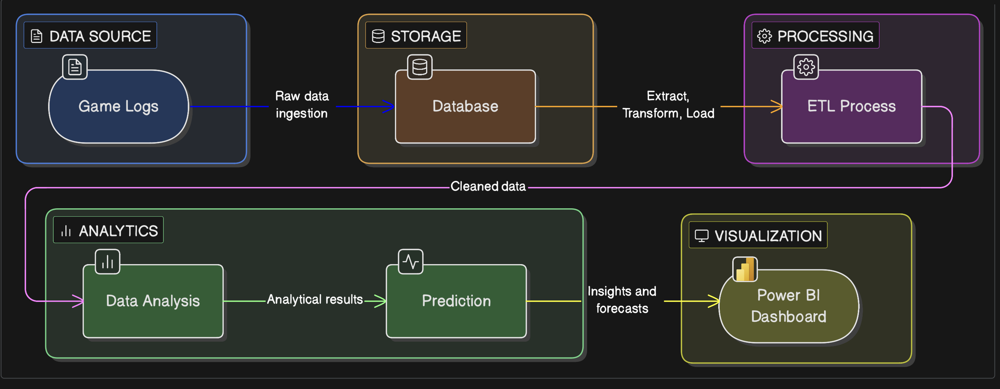
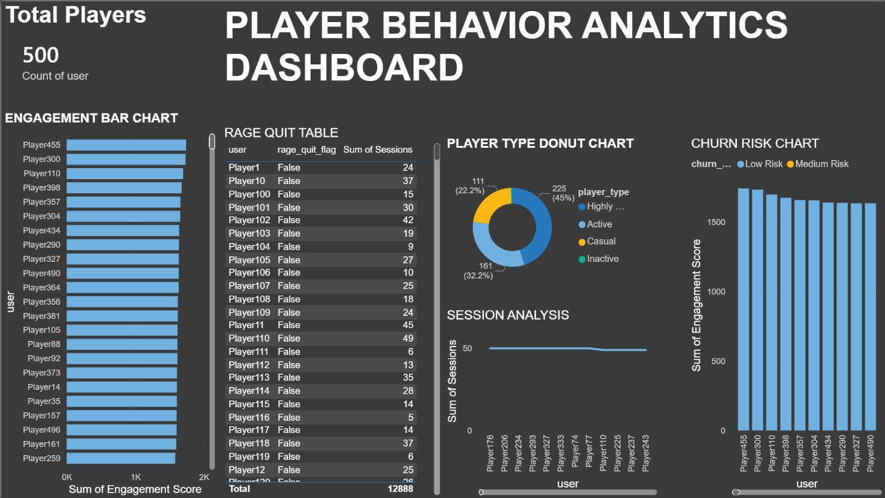

# 🎮 Player Behavior Analytics & Churn Prediction

### End-to-End Data Engineering Pipeline for Multiplayer Game Server Logs

<p align="center">

<strong>Transforming raw Minecraft gameplay data into meaningful player behavior insights and churn-risk analytics.</strong>

</p>

<p align="center">


</p>

<p align="center">


</p>

---

## 📌 Overview

**Player Behavior Analytics & Churn Prediction** is an end-to-end **Data Engineering and Analytics project** designed to transform raw multiplayer game-server activity into structured player intelligence.

The project uses a Minecraft multiplayer server as the data source. Player activities are captured using **CoreProtect**, stored in a **SQLite database**, extracted and processed using **Python and pandas**, transformed into player-level behavioral metrics, and visualized using **Microsoft Power BI**.

The project demonstrates a complete **Extract → Transform → Load (ETL)** workflow combined with behavioral analytics and basic churn-risk prediction.

---

# 🎯 Objectives

The main objectives of this project are:

* Collect raw gameplay activity from a multiplayer Minecraft server
* Capture player activities using CoreProtect
* Store raw gameplay information in SQLite
* Extract structured datasets using Python
* Clean and preprocess raw gameplay records
* Transform raw events into player-level metrics
* Calculate player engagement scores
* Analyze player behavior patterns
* Classify players according to engagement level
* Identify potential rage-quit behavior
* Predict player churn risk
* Build interactive Power BI dashboards
* Demonstrate practical Data Engineering concepts using a gaming use case

---

# 🏗️ Data Engineering Architecture

The project follows a structured pipeline starting from raw Minecraft game logs and ending with analytics and Power BI visualization.

<p align="center">
  
</p>

### Architecture Flow

```text
┌─────────────────────┐
│     GAME LOGS       │
│ Minecraft Activity  │
└──────────┬──────────┘
           │
           ▼
┌─────────────────────┐
│      DATABASE       │
│       SQLite        │
└──────────┬──────────┘
           │
           ▼
┌─────────────────────┐
│    ETL PROCESS      │
│ Extract             │
│ Transform            │
│ Load                 │
└──────────┬──────────┘
           │
           ▼
┌─────────────────────┐
│    DATA ANALYSIS    │
│ Player Metrics      │
│ Behavior Analysis   │
└──────────┬──────────┘
           │
           ▼
┌─────────────────────┐
│     PREDICTION      │
│    Churn Risk       │
└──────────┬──────────┘
           │
           ▼
┌─────────────────────┐
│      POWER BI       │
│     Dashboard       │
└─────────────────────┘
```

---

# 🔄 Complete ETL Pipeline

```text
Minecraft Server
       │
       ▼
CoreProtect Plugin
       │
       ▼
SQLite Database
       │
       ▼
Data Ingestion
       │
       ▼
Data Cleaning
       │
       ▼
Data Transformation
       │
       ▼
Behavior Analytics
       │
       ▼
Churn Prediction
       │
       ▼
Final Analytics Dataset
       │
       ▼
Power BI Dashboard
```

---

# ⚙️ Technology Stack

| Technology             | Purpose                                                |
| ---------------------- | ------------------------------------------------------ |
| **PaperMC**            | High-performance Minecraft server software             |
| **CoreProtect**        | Captures and stores player activity logs               |
| **SQLite**             | Raw gameplay database                                  |
| **Python 3**           | Data ingestion, cleaning, transformation and analytics |
| **sqlite3**            | Python interface for SQLite                            |
| **pandas**             | Data manipulation, cleaning and metric calculation     |
| **CSV**                | Intermediate data storage                              |
| **Microsoft Power BI** | Interactive analytics and visualization                |

---

# 📂 Project Structure

```text
player-behavior-analytics/
│
├── assets/
│   ├── pipeline.png
│   └── Dashboard.jpeg
│
├── docs/
│   └── Final Report.pdf
│
├── scripts/
│   ├── ingest.py
│   ├── clean.py
│   ├── transform.py
│   ├── analytics.py
│   ├── run_pipeline.py
│   └── generate_sample_data.py
│
├── data/
│   ├── raw/
│   ├── clean/
│   └── output/
│
├── requirements.txt
├── README.md
└── .gitignore
```

---

# 🧩 Pipeline Components

## 1. Data Source — Minecraft Server

The project uses a multiplayer Minecraft server as the source of gameplay data.

Players generate different types of activity, including:

* Login and logout sessions
* Chat messages
* Block breaking
* Block placement
* Other recorded gameplay interactions

---

## 2. Data Collection — CoreProtect

**CoreProtect** is used to capture detailed player activity from the Minecraft server.

The project report identifies the following recorded information:

```text
Player Sessions
Chat Messages
Block Break Events
Block Place Events
Gameplay Interactions
```

The captured information is stored in the CoreProtect SQLite database.

---

# 🗄️ Raw Database

The CoreProtect database is stored as:

```text
plugins/CoreProtect/database.db
```

The project extracts three primary datasets:

| Dataset        | Description                  |
| -------------- | ---------------------------- |
| `sessions.csv` | Player login/session records |
| `chat.csv`     | Player chat messages         |
| `blocks.csv`   | Block break/place activity   |

---

# 📥 Data Ingestion

The `scripts/ingest.py` program connects to the SQLite database and extracts the required CoreProtect tables.

### CoreProtect tables

```text
co_session
co_chat
co_block
```

### Process

```text
SQLite Database
      │
      ├── co_session ──→ sessions.csv
      │
      ├── co_chat ─────→ chat.csv
      │
      └── co_block ────→ blocks.csv
```

### Technologies

```text
Python
sqlite3
pandas
```

---

# 🧹 Data Cleaning

The `scripts/clean.py` program prepares the extracted data for analytics.

The cleaning stage performs:

* Null-value removal
* Duplicate removal
* Irrelevant-column removal
* Empty-message filtering
* Basic dataset standardization

### Clean datasets

```text
clean_sessions.csv
clean_chat.csv
clean_blocks.csv
```

---

# 🔧 Data Transformation

The transformation stage converts raw gameplay events into player-level metrics.

The following metrics are generated:

```text
Session Count
Chat Count
Block Activity
Engagement Score
Rage Quit Flag
```

---

# 📊 Player Metrics

## Session Count

Measures the total number of times a player logged into the Minecraft server.

```text
Session Count = Number of login events
```

A higher session count indicates more frequent server visits.

---

## 💬 Chat Count

Measures the total number of chat messages sent by a player.

```text
Chat Count = Number of chat events
```

Chat activity represents a player's social engagement with the server community.

---

## ⛏️ Block Activity

Measures the total number of block-related gameplay actions.

```text
Block Activity =
Block Breaks + Block Placements
```

This represents direct interaction with the Minecraft game world.

---

# 🧮 Engagement Score

The project uses a custom weighted engagement formula.

```text
Engagement Score =
(Session Count × 2)
+
(Chat Count × 1)
+
(Block Activity × 3)
```

### Weighting

| Metric         | Weight |
| -------------- | -----: |
| Session Count  |     ×2 |
| Chat Count     |     ×1 |
| Block Activity |     ×3 |

Block activity receives the highest weight because it represents direct gameplay interaction.

---

# 🚪 Rage Quit Detection

A player is flagged as a potential rage quitter when:

```text
Session Count < 2
```

The resulting field is:

```text
rage_quit_flag
```

Possible values:

```text
TRUE
FALSE
```

This is intended to identify players who joined the server but did not return frequently.

---

# 👥 Player Behavior Classification

Players are classified based on their engagement score.

| Engagement Score | Player Type       |
| ---------------: | ----------------- |
|          `≥ 150` | **Highly Active** |
|       `80 – 149` | **Active**        |
|        `30 – 79` | **Casual**        |
|           `< 30` | **Inactive**      |

### Highly Active

Players with very high engagement who participate frequently.

### Active

Regular players who consistently interact with the server.

### Casual

Players with below-average or occasional activity.

### Inactive

Players with very low or zero engagement.

---

# 📉 Churn Risk Prediction

The project implements a basic rule-based churn prediction engine.

### High Risk

```text
Session Count < 2
AND
Engagement Score < 20
```

### Medium Risk

```text
Engagement Score < 50
```

### Low Risk

```text
All other players
```

The purpose of this analysis is to identify players who may be at risk of stopping their gameplay activity.

> **Note:** This project implements rule-based churn prediction. It does not use a trained machine-learning model.

---

# 📦 Final Analytics Dataset

After transformation and analytics, the project generates:

```text
final_analytics.csv
```

The final dataset contains player-level information including:

```text
user
session_count
chat_count
block_activity
engagement_score
rage_quit_flag
player_type
churn_risk
```

This dataset becomes the input for Power BI.

---

# 📈 Power BI Dashboard

The final analytics dataset is visualized using Microsoft Power BI.

<p align="center">
  
</p>

The dashboard provides a consolidated view of player activity, engagement, behavior and churn risk.

---

## 📊 Dashboard Components

### Engagement Bar Chart

Ranks players according to their engagement score.

### Rage Quit Table

Displays player-level rage-quit information and session activity.

### Player Type Donut Chart

Shows the distribution of:

```text
Highly Active
Active
Casual
Inactive
```

### Churn Risk Chart

Visualizes players according to churn-risk categories.

### Session Analysis

Displays session activity patterns.

### Total Players

Shows the total number of players included in the analytics dataset.

---

# 🧠 Data Engineering Concepts

This project demonstrates multiple practical Data Engineering concepts.

| Data Engineering Concept | Implementation                 |
| ------------------------ | ------------------------------ |
| **Data Collection**      | CoreProtect gameplay logging   |
| **Data Ingestion**       | SQLite database extraction     |
| **ETL Pipeline**         | Extract → Transform → Load     |
| **Data Cleaning**        | Null and duplicate removal     |
| **Data Transformation**  | Player-level metric generation |
| **Database Storage**     | SQLite                         |
| **Intermediate Storage** | CSV                            |
| **Behavioral Analytics** | Player classification          |
| **Predictive Analytics** | Rule-based churn risk          |
| **Data Visualization**   | Power BI dashboards            |

---

# 🐍 Python Scripts

## `ingest.py`

Extracts raw data from CoreProtect SQLite.

```text
SQLite
   ↓
sessions.csv
chat.csv
blocks.csv
```

---

## `clean.py`

Cleans and prepares raw datasets.

```text
Raw CSV
   ↓
Clean CSV
```

---

## `transform.py`

Creates player-level metrics.

```text
Clean Data
   ↓
Player Metrics
```

---

## `analytics.py`

Performs:

* Player classification
* Churn-risk prediction
* Final analytics generation

```text
Player Metrics
      ↓
Behavior Classification
      ↓
Churn Prediction
      ↓
final_analytics.csv
```

---

## `run_pipeline.py`

Runs the complete pipeline automatically.

```bash
python scripts/run_pipeline.py
```

---

## `generate_sample_data.py`

Generates sample gameplay datasets for development and demonstration when the original CoreProtect database is unavailable.

---

# 🚀 Getting Started

## Prerequisites

Install:

* Python 3
* pip
* pandas

For real server data, you also need:

* PaperMC server
* CoreProtect
* CoreProtect SQLite database

---

# 1️⃣ Clone the Repository

```bash
git clone https://github.com/AmizhthanX/player-behavior-analytics.git
```

```bash
cd player-behavior-analytics
```

---

# 2️⃣ Install Dependencies

```bash
pip install -r requirements.txt
```

---

# 3️⃣ Using Real CoreProtect Data

Place the CoreProtect database at:

```text
plugins/CoreProtect/database.db
```

Then execute:

```bash
python scripts/run_pipeline.py
```

The pipeline performs:

```text
SQLite Database
       ↓
Data Ingestion
       ↓
Data Cleaning
       ↓
Data Transformation
       ↓
Behavior Analytics
       ↓
Churn Prediction
       ↓
Final Analytics Dataset
```

---

# 🧪 Running Without a Minecraft Database

A sample-data generator is included.

Run:

```bash
python scripts/generate_sample_data.py
```

Then:

```bash
python scripts/clean.py
```

```bash
python scripts/transform.py
```

```bash
python scripts/analytics.py
```

This makes it possible to demonstrate the project without exposing private Minecraft server data.

---

# 📁 Generated Data

After running the pipeline, the expected structure is:

```text
data/
│
├── raw/
│   ├── sessions.csv
│   ├── chat.csv
│   └── blocks.csv
│
├── clean/
│   ├── clean_sessions.csv
│   ├── clean_chat.csv
│   └── clean_blocks.csv
│
└── output/
    ├── player_metrics.csv
    └── final_analytics.csv
```

---

# 📄 Project Report

The complete academic project report is available in:

```text
docs/Final Report.pdf
```

### 📑 [View Final Project Report](docs/Final%20Report.pdf)

The report includes:

* Introduction
* Objectives
* System Architecture
* Implementation Steps
* Data Ingestion
* Data Cleaning
* Data Transformation
* Behavior Analytics
* Churn Prediction
* Power BI Visualization
* Player Metrics
* Technologies Used
* Data Engineering Concepts
* Results and Dashboards
* Learnings and Outcomes
* Conclusion

---

# 📸 Project Visuals

## Data Engineering Pipeline

<p align="center">
  
</p>

## Power BI Analytics Dashboard

<p align="center">
  
</p>

---

# 🎓 Academic Project

**Department of Computer Science and Engineering**

**Subject:** Data Engineering

**Year:** II Year – B Section

### Team Members

| Member                | Role        |
| --------------------- | ----------- |
| **S. Amizhthan**      | Team Lead   |
| **N. Magiratchan**    | Team Member |
| **D. Sri Balaji**     | Team Member |
| **H. Mohamed Fasith** | Team Member |

---

# 📚 Learning Outcomes

Through this project, the team gained practical experience in:

* Multiplayer server management
* Gameplay log analysis
* SQLite database handling
* Python data processing
* pandas-based ETL
* Data cleaning
* Data transformation
* Player behavior analytics
* Churn-risk analysis
* Power BI dashboard creation
* End-to-end Data Engineering workflows

---

# 🔮 Future Improvements

The current system provides a foundation that can be extended into a more advanced real-time analytics platform.

Potential improvements include:

* Real-time gameplay analytics
* Automated data ingestion
* Scheduled ETL pipelines
* Cloud database integration
* Streaming gameplay events
* Advanced player segmentation
* Machine-learning-based churn prediction
* Player lifetime-value analysis
* Automated player-retention recommendations
* Real-time Power BI reporting

---

# 🔐 Data & Privacy

Raw Minecraft server databases may contain server-specific information and should not be committed to a public repository.

For demonstration purposes, this repository includes a sample-data generator.

Sensitive or private server data should remain outside version control.

---

# ⭐ Project Highlights

```text
✔ End-to-end Data Engineering pipeline
✔ Minecraft gameplay data collection
✔ CoreProtect activity logging
✔ SQLite database ingestion
✔ Python + pandas ETL
✔ Data cleaning and transformation
✔ Player engagement scoring
✔ Behavioral classification
✔ Rage-quit detection
✔ Churn-risk prediction
✔ Power BI visualization
✔ Reproducible analytics workflow
✔ Sample-data generation
```

---

# 👨‍💻 Author

## S. Amizhthan

**Computer Science Engineering Student**

**Data Engineering • Python • Data Analytics • Power BI • Software Development**

### GitHub

[@AmizhthanX](https://github.com/AmizhthanX)

---

<p align="center">

### ⭐ If you found this project interesting, consider starring the repository.

</p>

<p align="center">

<strong>Built with Python, Data Engineering, Power BI, and Minecraft.</strong>

</p>

<p align="center">

`PLAYER BEHAVIOR ANALYTICS`

`ETL • PYTHON • SQLITE • POWER BI • DATA ENGINEERING`

</p>
